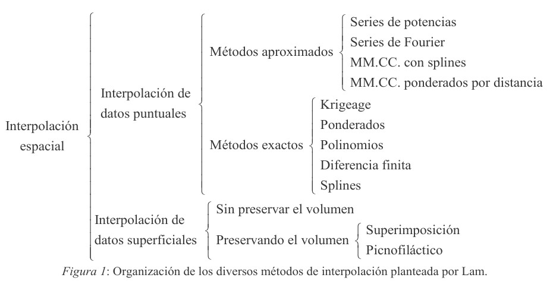

```{r setup, include=FALSE}
options(htmltools.dir.version = FALSE)
```

class: center, middle
background-image: url(img/fondo.jpg)

# Análisis espacial (2). Interpolación y geoestadística
## Introducción a R y QGIS para el análisis geoespacial con apoyo de inteligencia artificial
### *José Martínez*
### Universidad Autónoma de Santo Domingo (UASD)
#### 2024-07-09

---

# Un resto que nos quedó

## Apilado en QGIS

## Porcentajes de cobertura en EE

---

# Interpolación y geoestadística

- Interpolación: Técnica matemática utilizada para **estimar valores desconocidos** entre puntos de datos conocidos, proporcionando una función continua a partir de un conjunto discreto de observaciones.

Geoestadística:  Rama de la estadística que se enfoca en el **análisis de datos espaciales y temporales**, aplicando métodos como el krigeaje para modelar y predecir fenómenos en diversas disciplinas, incluyendo geología, medio ambiente, hidrología, agricultura, epidemiología, y otros campos que manejan datos georreferenciados.

---

## Métodos de interpolación



En: http://pdi.topografia.upm.es/jjarranz/articulos/Suavizado_DEM.pdf
---

# Cuarteto de Anscombe

## Datos

```{r}
data(anscombe)
anscombe
```


---

## Estadísticos

```{r}
# Media
print(sapply(1:8, function(x) mean(anscombe[ , x])), digits = 2)

# Varianza
print(sapply(1:8, function(x) var(anscombe[ , x])), digits = 2)

# Correlación
print(sapply(1:4, function(x)
  cor(anscombe[ , x], anscombe[ , x+4])), digits = 2)
```

---

## Modelos

```{r}
lm(x1 ~ y1, anscombe)
lm(x2 ~ y2, anscombe)
```

---

## Modelos (cont.)

```{r}
lm(x3 ~ y3, anscombe)
lm(x4 ~ y4, anscombe)
```

---

## Gráficos

```{r, echo=F}
# op <- par(mfrow=c(1,4), mar = c(0,0,2,3), oma = c(5, 4.2, 0, 0))
op <- par(mfrow = c(2, 2), mar = c(1, 1, 2.5, 1), oma = c(2, 2, 2, 2))
with(anscombe, plot(x1, y1, xlab = "", ylab = "", main = bquote(paste(italic(r),
" = ",.(round(cor(x1, y1),2)))))); abline(3,0.5) 
with(anscombe, plot(x2, y2, xlab = "", ylab = "",, main = bquote(paste(italic(r),
" = ",.(round(cor(x2, y2),2)))))); abline(3,0.5) 
with(anscombe, plot(x3, y3, xlab = "", ylab = "",, main = bquote(paste(italic(r),
" = ",.(round(cor(x3, y3),2)))))); abline(3,0.5) 
with(anscombe, plot(x4, y4, xlab = "", ylab = "",, main = bquote(paste(italic(r),
" = ",.(round(cor(x4, y4),2)))))); abline(3,0.5) 
mtext(expression(italic(y[1])),side=1, outer = TRUE, line = 3)
mtext(expression(italic(y[2])),side=2, outer = TRUE, line = 2.6)
mtext("(a)",side=3, at = -42, line = .5)
mtext("(b)",side=3, at = -26, line = .5)
mtext("(c)",side=3, at = -10.3, line = .5)
mtext("(d)",side=3, at = 5.5, line = .5)
par(op)
```

---

# La docena del datasauro


En: https://jumpingrivers.github.io/datasauRus/

---

# Semivariograma, y las limitaciones de la estadística univariada

## Usando la explicación de Isaak

```{r, results='asis', echo=F}
for (i in 1:13) {
  cat("---\n\n")
  cat(paste0(", ".jpg)\n\n"))
}
```


---

## Usando datos de abundancia y riqueza

(presentación de diapositivas separada)

---

## Buena referencia

- Usa también Python

- [GeostatsPy Python Package](https://github.com/GeostatsGuy/GeostatsPy)


---

# Kriging, krigeaje o krigeado 

- Definición: método geoestadístico que estima valores en ubicaciones no muestreadas utilizando la covarianza espacial entre los puntos conocidos para proporcionar una predicción óptima y minimizar el error de estimación.

- Desarrollado inicialmente por Daniel Krige y formalizado por Georges Matheron, el krigeaje es una técnica fundamental en la geoestadística para la interpolación espacial.

---

## Algunos métodos de kriging

| Método            | Asume                             | Ventajas                                        | Aplicaciones                           | Ecuación                                                                 |
|-------------------|-----------------------------------|-------------------------------------------------|---------------------------------------|--------------------------------------------------------------------------|
| Ordinary Kriging  | Media constante y desconocida     | No requiere media conocida                      | Datos sin información previa          | $\small \hat{Z}(x_0) = \sum_{i=1}^{N} \lambda_i Z(x_i)$|
| Simple Kriging    | Media constante y conocida        | Cálculo sencillo con media conocida             | Media conocida por estudios previos   | $\small \hat{Z}(x_0) = \mu + \sum_{i=1}^{N} \lambda_i (Z(x_i) - \mu)$|
| Universal Kriging | Media no constante (tendencia)    | Maneja tendencias espaciales                    | Datos con gradientes conocidos        | $\small \hat{Z}(x_0) = T(x_0) + \sum_{i=1}^{N} \lambda_i (Z(x_i) - T(x_i))$|
| Regression Kriging| Modelo de regresión y residuos    | Integra variables auxiliares                    | Datos con covariables informativas    | $\small \hat{Z}(x_0) = \beta_0 + \beta_1 x_0 + \sum_{i=1}^{N} \lambda_i e(x_i)$|

---

...donde

- $\hat{Z}(x_0)$: Valor predicho en el punto $x_0$.
- $Z(x_i)$: Valor de la variable en el punto conocido $x_i$.
- $\lambda_i$: Peso asignado al punto $x_i$.
- $\mu$: Media conocida del proceso (en Simple Kriging).
- $T(x)$: Función de tendencia en Universal Kriging.
- $\beta_0, \beta_1$: Coeficientes del modelo de regresión en Regression Kriging.
- $e(x_i)$: Residuos del modelo de regresión en Regression Kriging.

---

# Reglas Empíricas para Variogramas

## Conoce tus datos

- Calcula estadísticas básicas: mínimo, máximo, mediana, media, desviación estándar, varianza y asimetría.

- Usa un informe de variograma para mostrar estos datos.

- Crea mapas de dispersión e histogramas.

## Mantén el modelo simple

- Elige el modelo más simple que reproduzca las características esenciales del variograma experimental.

---

## Usa el modelo predeterminado

- Para un análisis inicial, utiliza el variograma lineal por defecto.

- Nota: La cuadrícula de desviación estándar kriging con este variograma no es fiable.

## Anisotropía

- Evita ratios de anisotropía mayores a 3:1 sin justificación física clara.

- Una anisotropía alta sin justificación puede indicar una tendencia en los datos. Considera eliminarla antes.

---

## Prueba y compara modelos

- Genera cuadrículas y mapas de contorno para diferentes modelos de variograma.

- Si las diferencias son mínimas, elige el modelo más simple.

## Rango del variograma

- El rango suele coincidir con el tamaño promedio de las anomalías en los valores Z.

- Usa esta regla si no tienes un variograma experimental fiable.

---

## Variograma fluctuante

- Un variograma experimental que fluctúa alrededor de un valor constante indica que los valores Z no están correlacionados a la escala de muestreo. 

- Necesitarás más datos con un espaciado de muestra más cercano.

## Sill del variograma

- El sill puede aproximarse a la varianza de la muestra si:

  1. Los datos están distribuidos uniformemente.

  2. No hay tendencias significativas.

  3. El área es más de tres veces el rango del variograma.


---

# Ejercicios

---

## "Ejercicio" 1. SAGA GIS

- Primero asegurarse de que no se tiene instalado.

- Página de SAGA: https://saga-gis.sourceforge.io/en/index.html

- Página directa de descargas (escoger la versión más reciente; versión 9.5 a 9 de julio de 2024): https://sourceforge.net/projects/saga-gis/files/

- En dicha ruta, el archivo que termina en `_setup.exe` es un instalador el cual, a su vez (y con suerte), crea un icono en el Menú Inicio. El que pone `_x64.zip` es un comprimido con binarios ejecutables que no necesita instalación.

- Vídeo de ayuda: Installing SAGA GIS in QGIS 3.0 or above https://www.youtube.com/watch?v=iTr7fQucqUA

---

## Ejercicio 2. Kriging ordinario en SAGA GIS

En SAGA GIS o QGIS, reproduce la parte 1 de [este cuaderno RMarkdown](https://github.com/geofis/curso-r-qgis-2024-verano/blob/main/media/analisis-espacial-02-demo-con-datos-puntuales.md#estudio-de-caso-precipitaci%C3%B3n-de-rep%C3%BAblica-dominicana-mediante-kriging-ordinario), correspondiente al kriging ordinario (Estudio de caso: precipitación de República Dominicana mediante kriging ordinario), siguiendo la grabación de la sesión de clases.

---

## Ejercicio 3. Kriging ordinario en R

- En R, reproduce la parte 1 de [este cuaderno RMarkdown](https://github.com/geofis/curso-r-qgis-2024-verano/blob/main/media/analisis-espacial-02-demo-con-datos-puntuales.md#estudio-de-caso-precipitaci%C3%B3n-de-rep%C3%BAblica-dominicana-mediante-kriging-ordinario), correspondiente al kriging ordinario (Estudio de caso: precipitación de República Dominicana mediante kriging ordinario), siguiendo la grabación de la sesión de clases. Compara los resultados con los obtenidos en SAGA GIS, las ventajas y desventajas de usar R contra SAGA GIS/QGIS.

---

## Ejercicio 4. Kriging por regresión en R

- En R, reproduce la parte 1 de [este cuaderno RMarkdown](https://github.com/geofis/curso-r-qgis-2024-verano/blob/main/media/analisis-espacial-02-demo-con-datos-puntuales.md#estudio-de-caso-temperatura-de-rep%C3%BAblica-dominicana-mediante-kriging-universal), correspondiente al kriging por regresión (Estudio de caso: temperatura de República Dominicana mediante kriging universal), siguiendo la grabación de la sesión de clases.

---

## Ejercicio 5. Elige un conjunto de datos y realiza una interpolación con kriging universal o kriging por regresión

---

## Bonus. Diseño de muestreo sistemático y aleatorio.

1. En QGIS, usando la capa de provincias de República Dominicana, elige una provincia y crea un diseño de muestreo sistemático usando una distancia de separación "razonable" (una distancia de separación de menos de 1000 m, podría ser muy denso; podrías usar también criterio de densidad, es decir, número de puntos por unidad de superficie).

2. Realiza un diseño de muestreo espacial estratificado en QGIS.
  - [Guía para la práctica](https://github.com/geofis/curso-sig-doctorado-2024-verano/blob/main/media/practica-muestreo.md)
  - [Vídeo demostrativo para realizar esta práctica](https://drive.google.com/file/d/1k6IotOHj6fUkyfi4rSBK6d320TY45KED/view?usp=drive_link)

---

# Referencias destacadas

Bivand, R. S., Pebesma, E., & Gómez-Rubio, V. (2013). Applied Spatial Data Analysis with R. Springer New York. https://doi.org/10.1007/978-1-4614-7618-4

Olaya, V. (2020). Sistemas de Información Geográfica. https://volaya.github.io/libro-sig/

Lovelace, R., Nowosad, J., & Muenchow, J. (2019). Geocomputation with R. Chapman and Hall/CRC. https://r.geocompx.org/

Dorman, M., Graser A., Nowosad, J. & Lovelace, R. (2019). Geocomputation with Python. Chapman and Hall/CRC. https://py.geocompx.org/

Isaaks, E. H., & Srivastava, M. (1989). Applied geostatistics.

Pyrcz, M.J., Jo. H., Kupenko, A., Liu, W., Gigliotti, A.E., Salomaki, T., and Santos, J., 2021, GeostatsPy Python Package, PyPI, Python Package Index, https://pypi.org/project/geostatspy/.