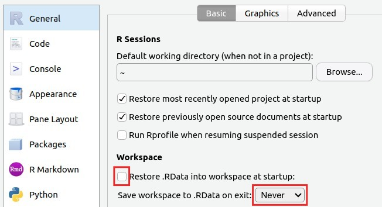

```{r setup, include=FALSE}
options(htmltools.dir.version = FALSE)
```

class: center, middle
background-image: url(img/fondo.jpg)

# Día 0. Manipulación y visualización de datos geoespaciales con R
## Introducción a R y QGIS para el análisis geoespacial con apoyo de inteligencia artificial
### *José Martínez*
### Universidad Autónoma de Santo Domingo (UASD)
#### 2024-06-17


# R + RStudio

- Primero lo primero (es importante, me gasto una diapo y todo en esto), cuando accedas a tu cuenta en el servidor RStudio, configura lo siguiente:

  - Menú Tools>Global Options>R General>Workspace, desmarca `Restore .RData into workspace at startup:`, y en la opción `Save workspace to .RData on exit:` elige `Never`.
  
      
    
  - "Yo podía hacerlo por ti, pero preferí que lo hicieras tú, dado que para garantizar la reproducibilidad de análisis, este paso es importante". Firmado: tu administrador del servidor de programación.

---

```{r out.width='100%', fig.height=6, eval=require('leaflet')}
library(leaflet)
leaflet() %>%
  addProviderTiles(providers$Esri.WorldImagery, options = providerTileOptions(maxZoom = 21)) %>%
  leaflet::addMiniMap() %>% 
  setView(-69.91640, 18.45949, zoom = 17) %>%
  leafem::addMouseCoordinates()
```

---
