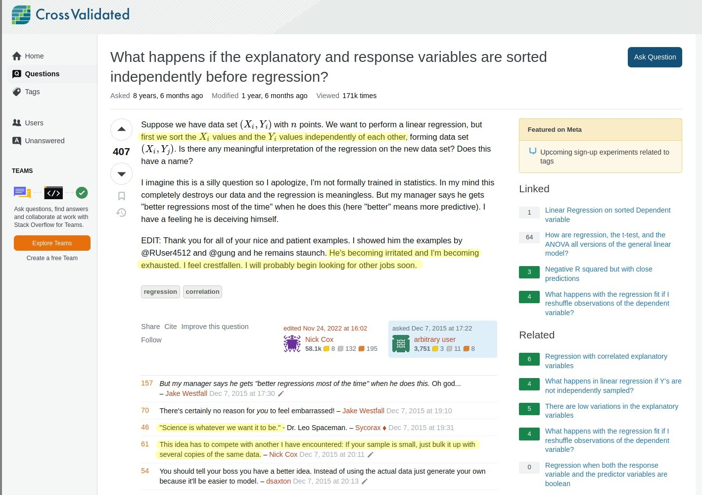
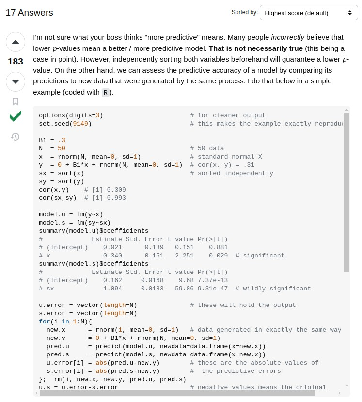

```{r setup, include=FALSE}
options(htmltools.dir.version = FALSE)
knitr::opts_chunk$set(message = F, warning = F)
```

class: center, middle
background-image: url(img/fondo.jpg)

# Motivación
## Introducción a R y QGIS para el análisis geoespacial con apoyo de inteligencia artificial
### *José Martínez*
### Universidad Autónoma de Santo Domingo (UASD)
#### 2024-06-17

---

# Hola Mundo

- Logística
  - Baños
  - WiFi

- Autopresentación

- Chivo

---

```{r out.width='100%', fig.height=6, eval=require('leaflet')}
library(leaflet)
leaflet() %>%
  addProviderTiles(providers$Esri.WorldImagery, options = providerTileOptions(maxZoom = 21)) %>%
  leaflet::addMiniMap() %>% 
  setView(-69.91640, 18.45949, zoom = 17) %>%
  leafem::addMouseCoordinates()
```

---

# Motivación

## Un ejemplo de por qué es importante la autocorrelación

---


[Fuente: Cross Validated](https://stats.stackexchange.com/questions/185507/what-happens-if-the-explanatory-and-response-variables-are-sorted-independently)

---


[Fuente: Cross Validated](https://stats.stackexchange.com/questions/185507/what-happens-if-the-explanatory-and-response-variables-are-sorted-independently)

---

### Demostración con código informático reproducible

```{r}
options(digits=3)                       # for cleaner output
set.seed(9149)                          # this makes the example exactly reproducible

B1 = .3
N  = 50                                 # 50 data
x  = rnorm(N, mean=0, sd=1)             # standard normal X
y  = 0 + B1*x + rnorm(N, mean=0, sd=1)  # cor(x, y) = .31
sx = sort(x)                            # sorted independently
sy = sort(y)
```

---

### Correlación

```{r}
cor(x,y)    # [1] 0.309
cor(sx,sy)  # [1] 0.993
```

---

### Regresión

```{r}
model.u = lm(y~x)
model.s = lm(sy~sx)
summary(model.u)$coefficients
summary(model.s)$coefficients
```


```{r, echo=F, include=F}
u.error = vector(length=N)              # these will hold the output
s.error = vector(length=N)
for(i in 1:N){
  new.x      = rnorm(1, mean=0, sd=1)   # data generated in exactly the same way
  new.y      = 0 + B1*x + rnorm(N, mean=0, sd=1)
  pred.u     = predict(model.u, newdata=data.frame(x=new.x))
  pred.s     = predict(model.s, newdata=data.frame(x=new.x))
  u.error[i] = abs(pred.u-new.y)        # these are the absolute values of
  s.error[i] = abs(pred.s-new.y)        #  the predictive errors
};  rm(i, new.x, new.y, pred.u, pred.s)
u.s = u.error-s.error                   # negative values means the original
                                        # yielded more accurate predictions
mean(u.error)  # [1] 1.1
mean(s.error)  # [1] 1.98
mean(u.s<0)    # [1] 0.68
```

---

### Gráficos

```{r, echo=F}
layout(matrix(1:4, nrow=2, byrow=TRUE))
plot(x, y,   main="Original data")
abline(model.u, col="blue")
plot(sx, sy, main="Sorted data")
abline(model.s, col="red")
h.u = hist(u.error, breaks=10, plot=FALSE)
h.s = hist(s.error, breaks=9,  plot=FALSE)
plot(h.u, xlim=c(0,5), ylim=c(0,11), main="Histogram of prediction errors",
     xlab="Magnitude of prediction error", col=rgb(0,0,1,1/2))
plot(h.s, col=rgb(1,0,0,1/4), add=TRUE)
legend("topright", legend=c("original","sorted"), pch=15, 
       col=c(rgb(0,0,1,1/2),rgb(1,0,0,1/4)))
dotchart(u.s, color=ifelse(u.s<0, "blue", "red"), lcolor="white",
         main="Difference between predictive errors")
abline(v=0, col="gray")
legend("topright", legend=c("u better", "s better"), pch=1, col=c("blue","red"))
```

---

## Aerosoles urbanos UASD

[Repo de GitHub de estudio de Matos y colaboradores: https://github.com/geofis/aerosoles-urbanos-uasd](https://github.com/geofis/aerosoles-urbanos-uasd)

---

## Hidrografía de RD

[Repo de GitHub: https://github.com/geofis/red-hidrografica-densa-rd](https://github.com/geofis/red-hidrografica-densa-rd)
