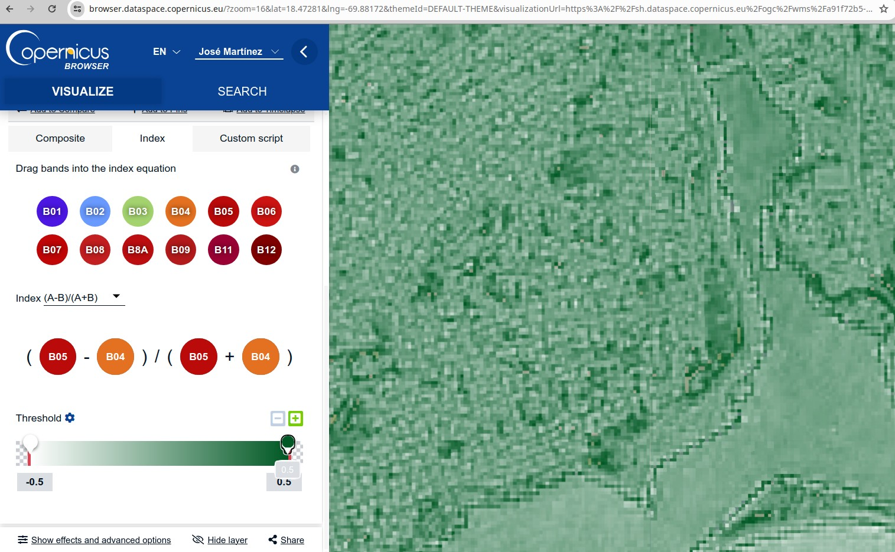
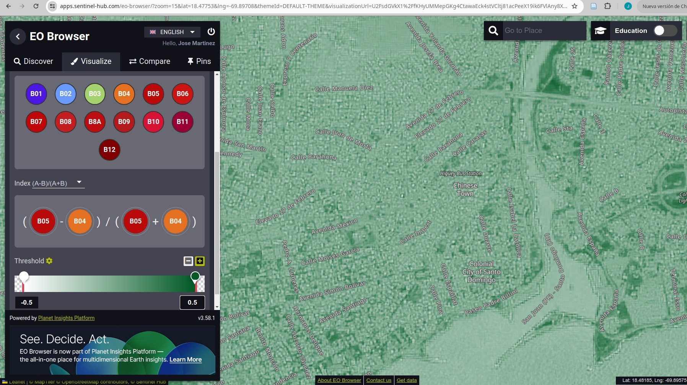

```{r setup, include=FALSE}
options(htmltools.dir.version = FALSE)
```

class: center, middle
background-image: url(img/fondo.jpg)

# Obtención de datos geoespaciales desde la nube
## Introducción a R y QGIS para el análisis geoespacial con apoyo de inteligencia artificial
### *José Martínez*
### Universidad Autónoma de Santo Domingo (UASD)
#### 2024-06-20

---

# Tu turno

## Pide ayuda al ChatGPT

Desde la siguiente diapositiva en adelante, verás varios ejercicios de aula. Este es un buen momento para que uses el ChatGPT. Pregúntale cómo hacerlo. Para interactuar con dicha herramienta en el contexto de nuestro tema, te recomiendo lo siguiente:

- Concisión. 

- Agilidad. No pierdas tiempo intentando conseguir la mejor ortografía ni la mejor redacción. Las palabras clave, y un "cierto orden", son más importantes. 

- Precisión en lo que se pregunta.

- Mejor dar órdenes.

- Truco: pídele que te documente código informático, que te lo explique.

---


# ¿Dónde encontrar fuentes satelitales (y otras)?

- Busca primero en el catálogo de Google Earth Engine: https://earthengine.google.com/
- Copernicus Data Space Ecosystem, Copernicus Browser: https://dataspace.copernicus.eu
- Sentinel Hub: https://www.sentinel-hub.com/
- USGS Earth Explorer: https://earthexplorer.usgs.gov/
- NASA Earthdata: https://earthdata.nasa.gov/
- Alaska Satellite Facility Vertex: https://vertex.daac.asf.alaska.edu/
- Planet Labs: https://www.planet.com/
- LandsatLook Viewer: https://landsatlook.usgs.gov/
- JAXA G-Portal (Japan Aerospace Exploration Agency): https://gportal.jaxa.jp/gpr/

---

# ¿Dónde encontrar fuentes satelitales (y otros tipos de datos)?

- Maxar: https://www.maxar.com/
- Copernicus Open Access Hub (está programado para retiro): https://scihub.copernicus.eu/
- OpenAerialMap: https://openaerialmap.org/
- TerraSAR-X/TanDEM-X: https://tandemx-science.dlr.de/
- Open Topography: https://opentopography.org/
- CHELSA, datos climáticos de alta resolución: https://chelsa-climate.org/
- WorlClim, mapas, gráficos, tablas y datos en general sobre el clima global:  https://worldclim.org/

---

# Copernicus Data Space Ecosystem


NDCI a través del Copernicus Browser https://dataspace.copernicus.eu

---

# Sentinel Hub



NDCI a través del EO Browser https://apps.sentinel-hub.com/eo-browser/

---

## Google EarthEngine a través del frontend de JavaScript (la aplicación web)

---

## Google EarthEngine a través de cuaderno Jupyter con `ee` y `geemap`

---

## Google EarthEngine a través de cuaderno Jupyter con `ee` y `geemap` -> SAM GEO
